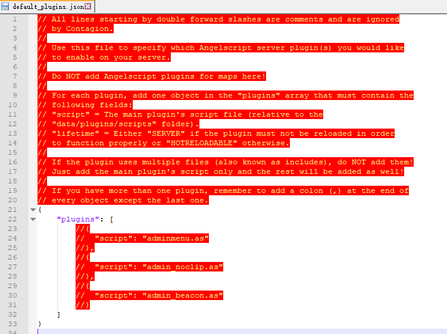

# 如何使用插件
在`游戏根目录\contagion\data\scripts`里面创建一个叫做plugins的文件夹。 
把插件的`as`或者`asc`文件丢进去 

## 方法一

>如果插件有问题将会直接报错一堆红字青字 

进入游戏，按"`"打开控制台，输入`as_loadplugin 插件文件名.as`。 

服务器使用的话有个`server.cfg`，把这个命令丢最后面就好了.

## 方法二

>全局加载指定的插件 

在这个目录： 
`游戏根目录\contagion` 
找到一个名叫`default_plugins.json`的文件 
然后打开它，他应该是长这样的 



不用管他，直接把我的代码复制粘贴进去，然后改成你需要的 

```
{
	"plugins": [
		{
			"script": "插件名.as",
			"lifetime":"慎用！如果插件再添加这个并且这里中文的内容改为SERVER"
		},
		{
			"script": "第二个插件的插件名.as"
		}
	]
}
```


