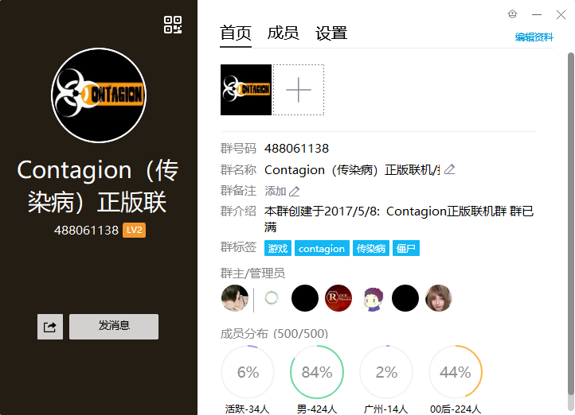

# 传染病-as插件
我的传染病游戏(Contagion)的天使插件（AngelScript）仓库。 
可以来QQ群一起联机哇 

## 描述
用于Contagion（传染病）游戏的天使插件（AngelScript）代码和各种文档。 
包括插件使用教程、插件下载、还有入门指南，我尽量把知识点案例都列举出来【好多flag o(>ω<)o 
我是真的懒，更新什么的别指望了。。 

## 目录&命名规则
>插件丢单独文件夹，附上使用效果截图等。 
### 目录
|名称|内容|
| ---- | ---- |
|docs|文档说明|
|Template|模板|
|其他文件夹|插件源码+插件截图|

### 举个栗子
>插件名称_@制作者.as 

`InfiniteCollectedAmmo@me.as`  
InfiniteCollectedAmmo -> 功能  
@me -> 制作者：我自己 

功能命名规则   
单控制台指令，一律使用控制台指令作为命名  
功能性的，大驼峰命名  
  
如果有不同的实现方法则后面加入"-"进行描述 

## [官方文档(全是嘤语QAQ)](https://contagion-game.com/api/)

## 入门学习用：献丑了 (/▽＼) 
[如何使用as插件](docs/如何使用插件.md)
|插件名|插件用途|知识点|作者|
| ---- | ---- | ---- | ---- |
|InfiniteCollectedAmmo|无限后备子弹|控制台命令查找和修改|我早期写的东西|
|RespawnToHuman-SayCommand|简单的使用命令复活成人类|聊天框内容获取+复活|早期写的东西|
|ShowConnectPlayerInfo|显示加入游戏的玩家的信息|API的使用：获取玩家信息|早期的测试东西|

## 【不用看】一些私人存档。
关于我和[紫冰](https://github.com/ZBzibing)的一些矛盾？ 
有人的地方就有矛盾 
他觉得我说话模棱两可不愿公开代码，我吐槽他说他只愿意考虑自己不考虑别人（**我对他的感受**） 
然后他就炸毛了。。炸毛了。。 
聊天记录当成存档吧。 
[ADC23DFA](others/关于紫冰和我的矛盾？.zip)

